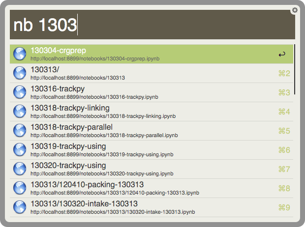

IPython notebook workflow for Alfred
====================================

This workflow allows users of [Alfred](http://www.alfredapp.com) for Mac OS X to (with paid "Powerpack") to search for [IPython](http://ipython.org/) notebooks on a running server.

This workflow lets you search for notebooks (and directories) available on your IPython notebook server, and open them in your web browser. It does not work with IPython versions earlier than 2.0.

- The "nb" keyword searches notebook and directory titles, sorting alphabetically. 
- The "nbr" keyword searches only notebooks, with most Recent ones at the top. 
- The "nbnew" keyword brings up a new untitled notebook in a directory of your choosing.
- The "nbcopy" keyword creates a copy of a notebook in the same directory.
- The "nbcopyr" keyword is like "nbcopy", but shows the most Recent ones at the top.

The default action is to open the notebook or directory in a web browser, but pressing Shift-Return pastes the notebook URL into the frontmost application. Option-Return pastes a formatted Markdown link, suitable for linking to that notebook from another notebook on the same server.

Note that this workflow actually queries the server, and so can search notebook servers running on other computers.

Installation
------------

You can [download this workflow bundle from packal.org](http://www.packal.org/workflow/ipython-notebooks). The downloaded file is just a packaged version of the files in this repository. Opening it will install the workflow in Alfred.

Configuration
-------------

The default behavior is to query the IPython notebook server running at http://127.0.0.1:8888/ (where it is usually found). To use a different server, use the "nbserver" keyword in the Alfred search box.

The URL is the same one reported by the IPython notebook server when it starts up, or that you type into your web browser. 

For example, to connect to an IPython notebook server running at port 8899 on your computer, type

`nbserver http://127.0.0.1:8899`

and press Return.

Caveats
-------

- For performance reasons, the list of notebooks on the server is cached for 30 seconds. Therefore, it can take up to 30 seconds for a new or renamed notebook to show up in these results.

- This workflow searches the list of *all* notebooks that are available to the notebook server. If you started your notebook server in a directory with lots of other files and subdirectories (for example, your home directory), this will take a long, long time.

License and Credits
-------------------

Copyright 2014 Nathan C. Keim

Licensed under the Apache License, Version 2.0. For details, see `filter.py` in the source code.

This workflow is built with the [Alfred-Workflow package](https://github.com/deanishe/alfred-workflow)
